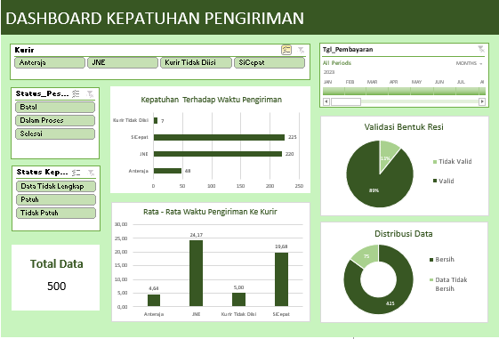

# Analisis Kepatuhan Proses Pemenuhan Pesanan

## Ringkasan & Tujuan Proyek

Proyek ini bertujuan untuk menganalisis data log pengiriman fiktif guna mengevaluasi tingkat kepatuhan (compliance) proses pemenuhan pesanan terhadap **Service Level Agreement (SLA)** yang telah ditetapkan. Analisis ini berfokus pada identifikasi area inefisiensi dan masalah kualitas data untuk memberikan rekomendasi perbaikan proses.

## Dashboard & Temuan Utama

Sebuah dashboard interaktif dibangun di Microsoft Excel untuk memvisualisasikan temuan-temuan kunci dari analisis.

Dari analisis terhadap 500 data pesanan (periode 2023-2025), ditemukan beberapa temuan krusial:

* **Kualitas Data Rendah:** Ditemukan banyak masalah fundamental pada data mentah, termasuk data tanggal yang hilang, inkonsistensi penulisan nama kurir, dan data tidak logis (misal: tanggal kirim lebih awal dari tanggal bayar). Hal ini menghalangi pengukuran kinerja yang akurat.

* **Kepatuhan Waktu Belum Optimal:** Sejumlah besar pesanan teridentifikasi **"Tidak Patuh"** karena waktu prosesnya melebihi SLA yang ditetapkan (5 hari), yang berisiko langsung pada kepuasan pelanggan.

* **Kelengkapan Data Krusial Rendah:** Banyak pesanan tidak dapat dianalisis status kepatuhannya karena data krusial seperti `Tgl_Diserahkan_Kurir` tidak diisi.

## Rekomendasi Utama

Berdasarkan temuan di atas, berikut adalah rekomendasi utama yang diusulkan:

1.  **Perbaiki Sistem Input Data (Prioritas Utama):** Terapkan validasi "wajib diisi" (*mandatory field*) pada sistem untuk kolom-kolom krusial seperti `Tgl_Diserahkan_Kurir` dan `Nomor_Resi` untuk mencegah data kosong di masa depan.
2.  **Investigasi Keterlambatan Operasional:** Lakukan analisis lebih dalam pada pesanan berstatus "Tidak Patuh" untuk menemukan akar masalah keterlambatan, apakah terjadi pada proses internal gudang atau pada proses serah terima dengan kurir tertentu.
3.  **Lakukan Pembersihan Data Historis:** Bentuk tim kecil untuk membersihkan dan memvalidasi data pengiriman historis agar analisis tren jangka panjang menjadi lebih akurat dan andal.

##  Proses & Alat yang Digunakan

* **Proses:**
    1.  Pemuatan & Penggabungan Data (dari beberapa file `.csv`)
    2.  Pembersihan & Transformasi Data (standarisasi, penanganan nilai kosong, dll.)
    3.  Pembuatan Kolom Analisis (*Feature Engineering*)
    4.  Analisis Agregat (menggunakan PivotTable)
    5.  Visualisasi & Pembuatan Dashboard Interaktif

* **Alat:**
    * Microsoft Excel 2019
    * Power Query
    * PivotTable

## Struktur Folder

* ` data/`: Berisi data mentah yang digunakan dalam analisis.
* ` docs/`: Berisi file `guide.md` (dokumentasi teknis) dan `insight.md` (laporan bisnis).
* ` dashboard/`: Berisi screenshot `.png` yang memuat dashboard final.
* ` result/`: Berisi hasil file excel yang telah dilakukan cleaning dan analisis.
